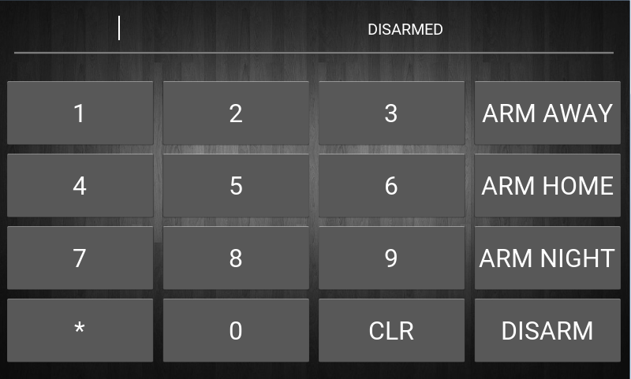
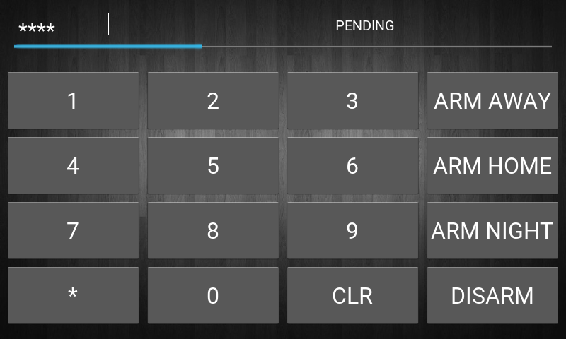

# MQTT Alarm Panel using Kivy
MQTT Alarm Panel is a UI built using Kivy for the Raspberry Pi. While the application can be modified to suit any kivy-capable hardware, its main purpose is to avoid using X and therefore save on limited Raspberry Pi resources. 

# Features
1. Runs on Kivy/Python - No need to boot to Raspberry Pi desktop!
2. Control of Manual MQTT Alarm in Home Assistant thanks to paho-mqtt
3. GPIO control for a Piezo Buzzer thanks to RPi.GPIO
4. Screen dimmer for night mode thanks to rpi_backlight
5. Settings menu (Alarm Code + * to open)

# Usage
After you have cloned the repo, edit settings.yaml and change details as required, then run sudo python main.py

Steps:
1. cd ~
2. git clone https://github.com/JediDork/MQTTAlarmPanel
3. cd MQTTAlarmPanel
4. sudo nano settings.yaml
5. sudo python main.py

Some modules may need to be installed prior. Ensure you have the following before you run the application:
- sudo pip install RPi.GPIO
- sudo pip install rpi_backlight
- sudo pip install paho-mqtt
- sudo pip install pyyaml

Obviously Kivy and Python need to be installed too - see https://kivy.org/docs/installation/installation-rpi.html

The settings menu can be reached by typing your alarm code + * on the interface.

# Screenshots
   

# Currently in Development
- Add MQTT username/password to connection string
- Bug fix: Check for network connection prior to attempting connection to MQTT service
- Add PIR service to indicate where sensors are being triggered
- Start a screensaver after a while